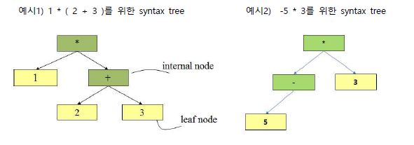
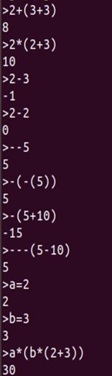
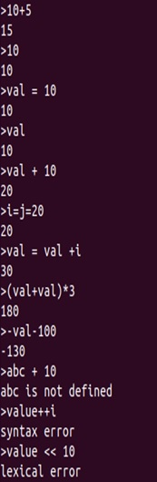
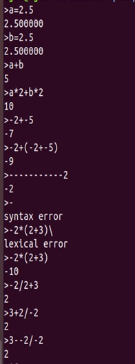

# Numerical Expression Calculator

## 개요
프로그램 실행 후 입력받는 수식을 통해 수식의 맞는 결과를 출력하는 일종의 계산기를 구현한다.

## 사용된 환경 & version
- Ubuntu 18.04.1 LTS (64bit)
- gcc (Ubuntu 7.4.0-1ubuntu1~18.04.1) 7.4.0
- flex 2.6.4

## 사용 시 주의사항

**입력및실행**

```bash
make
./a.out
1+2
```

**make로 생성 된 object 파일 삭제**

```bash
make clean
```

**flex가 설치되어 있지 않을 때 설치 및 version확인 방법**

```bash
sudo apt-get install flex -y
flex --version
```

## 기능 설명

- operator
    - binary operator로 '+', '-', '*', '/', '='(assignment)
    - unary operator '-'
        - ex) -5 + -10 ===> -15
        - --(5+10) ===> 15
        - -(-(5+10)) ===> 15

- 상수
    - integer
    - real number

- assignment operator(=)는 right associativity를 가진다.
    - ex) a = b = 10 ===> a = (b = 10) (결과 값은 10)

- interpreter는 2단계로 이루어져 있다.
    - 1단계 : Parsing 하면서 syntax tree를 생성한다.
    - 2단계 : 생성된 syntax tree를 계산하여 그 값을 출력한다.
     


## 입력및출력 예시

   